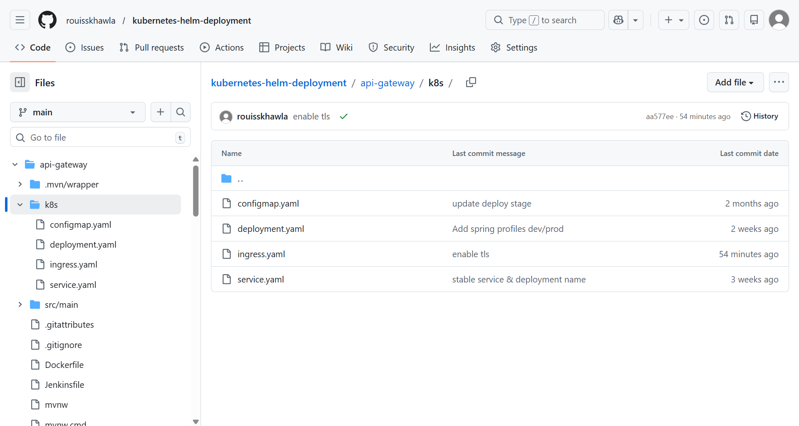

# Kubernetes Deployment Monorepo

This repository contains a monorepo setup for a microservice-based application, designed for streamlined CI/CD using Jenkins, Docker, and Kubernetes deployments.

---

## Project Structure

```
kubernetes-helm-deployment/
├── authors-service/
│   ├── Jenkinsfile
│   ├── Dockerfile
│   ├── pom.xml
│   └── k8s/
├── books-service/
│   ├── Jenkinsfile
│   ├── Dockerfile
│   ├── pom.xml
│   └── k8s/
├── api-gateway/
│   ├── Jenkinsfile
│   ├── Dockerfile
│   ├── pom.xml
│   └── k8s/
├── bookstore-frontend/
│   ├── Jenkinsfile
│   ├── Dockerfile
│   ├── package.json
│   └── k8s/
├── scripts/
│   └── version.sh
└── docs/
    ├── cluster-setup.md
    ├── screenshots/
    └── logs/
```

* **Back-end services:** `authors-service`, `books-service`, `api-gateway` (Java/Spring Boot, Maven)
* **Front-end service:** `bookstore-frontend` (Angular, NodeJS)
* **Shared scripts:** `scripts/version.sh` – semantic versioning logic used by all pipelines

Each service has its own `Jenkinsfile`, `Dockerfile`, **and Kubernetes manifests** under `k8s/`.

---

## CI/CD Architecture

We use **Jenkins Multibranch Pipelines** to manage independent pipelines per service. Each service builds, tests, pushes Docker images, and deploys to Kubernetes.

### Jenkins Dashboard

The dashboard shows all pipeline jobs per service:


---

## Branch Strategy & Environments

The CI/CD setup is **branch-driven** and environment-aware.

| Branch | Purpose     | Docker Tag Format | Target               |
| ------ | ----------- | ----------------- | -------------------- |
| `dev`  | Development | `X.Y.Z-dev`       | Kubernetes Cluster A |
| `main` | Production  | `X.Y.Z`, `latest` | Kubernetes Cluster B |

**Key rules:**

* Pipelines run on **both `dev` and `main`**
* Images are built **only when the service directory changes**
* Versioning is shared via `scripts/version.sh`

---

## Semantic Versioning Strategy

Versioning is handled **outside Jenkinsfiles** via the shared script:

```
scripts/version.sh
```

### Version Format

```
MAJOR.MINOR.PATCH
```

### Increment Rules

| Change Type                 | Version Increment |
| --------------------------- | ----------------- |
| Bug fix / small change      | PATCH             |
| Backward-compatible feature | MINOR             |
| Breaking change             | MAJOR             |

### Branch Behavior

* **dev branch**

  * Automatically increments **PATCH**
  * Appends `-dev` suffix
  * Example: `1.4.3-dev`

* **main branch**

  * Uses the same base version
  * No suffix
  * Also publishes `latest`
  * Example: `1.4.3`, `latest`

### Version Source of Truth

* The versioning script queries **Docker Hub** for the latest image tag of each service
* No build numbers or Git SHA–based tags are used
* Versions increase **only when files inside the service directory change**

#### Docker Hub Images

**API Gateway**
[Docker Hub – API Gateway](docs/screenshots/dockerhub-api-gateway.png)

---

## Jenkins Pipeline Overview

### Version Computation (All Services)

Each pipeline computes the version before building:

```bash
./scripts/version.sh <image-name> <branch>
```

The computed version is then used for:

* Docker build
* Docker push
* Deployment via Kubernetes manifests

---

### Back-end services

1. Checkout code
2. Compute semantic version
3. Maven build: `mvn clean package -DskipTests`
4. Docker build using service directory as context
5. Docker push with computed tag
6. Post-build actions & workspace cleanup

---

### Front-end service (`bookstore-frontend`)

1. Compute semantic version
2. Checkout code
3. Angular build:

```bash
npm ci
npm run build -- --configuration production
```

4. Docker build & push
5. Post-build actions & cleanup

**NodeJS Tool:** NodeJS 24 (configured in Jenkins)

---

## Credentials

| Credential ID      | Type              | Scope  | Username / Token    | Purpose                                                                                   |
| ------------------ | ----------------- | ------ | ------------------- | ----------------------------------------------------------------------------------------- |
| `dockerlogin`      | Username/Password | Global | Docker Hub username | Authenticate with Docker Hub to build and push images using a **Docker Hub access token** |
| `github-api-token` | Username/Password | Global | `x-access-token`    | Authenticate with GitHub using a **fine-grained Personal Access Token (PAT)**             |
| `kubeconfig-dev`   | Secret file       | Global | -                   | Kubernetes Dev cluster access                                                             |
| `kubeconfig-prod`  | Secret file       | Global | -                   | Kubernetes Prod cluster access                                                            |


### GitHub Fine-Grained PAT Details

* Generate a **fine-grained Personal Access Token (PAT)** in GitHub Developer settings
* **Repository access:** Select **“Only select repositories”** and choose this project repository
* Store it in Jenkins as **Username/Password credential**

  * **Username:** `x-access-token`
  * **Password:** GitHub PAT
  * Scope: **Global**

**Required PAT Permissions:**

* `repo:status` – Read and write commit statuses
* `repo:contents` – Read repository contents
* `repo:metadata` – Read repository metadata

### Docker Hub Access Token Details

* Generate an **access token** in Docker Hub
* Store it in Jenkins as **Username/Password credential**

  * **Username:** Docker Hub username
  * **Password:** Docker Hub access token
  * Scope: **Global** – usable by all pipelines

---

## Jenkins Configuration

**Plugins Required:**

* GitHub Branch Source
* Pipeline
* Docker Pipeline
* Maven Integration
* NodeJS Plugin

**Tools Configured:**

* Maven 3.9.11
* JDK 17
* NodeJS 24

---

## Jenkins Multibranch Pipeline Configuration

**Build Configuration:**

Each service is configured as a Jenkins **Multibranch Pipeline** pointing to its own `Jenkinsfile`.

* **Mode:** By Jenkinsfile
* **Script Path:** Example: `api-gateway/Jenkinsfile`
* **Branch Discovery:** All branches (`dev`, `main`)
* **Trigger:** GitHub webhook push events
  
[Pipeline Configuration](docs/screenshots/pipeline-config.png)

---

### Pipeline Branches per Service

Each service is configured as a **Jenkins Multibranch Pipeline**, automatically discovering and building multiple branches.

**Example – service pipeline showing `dev` and `main` branches:**


---

### Execute Pipeline Only When a Service Changes

All build-related stages are guarded by:

```groovy
when {
  changeset "${SERVICE_DIR}/**"
}
```

This ensures:

* No version bump without real changes
* No unnecessary Docker images
* Clean, predictable version history

---

## GitHub Webhook

**Webhook URL:**

```
https://ngrok-jenkins/github-webhook/
```

* Content type: `application/json`
* Trigger: Push events
* SSL verification: Enabled

[GitHub Webhook Settings](docs/screenshots/webhook-github-settings.png)

---

## Example Workflow

**Change pushed to `authors-service` on `dev`:**

```
authors-service:1.2.4-dev
```

**Promoted to `main`:**

```
authors-service:1.2.4
authors-service:latest
```


### Successful Pipeline Execution

The following screenshot shows a successful pipeline execution for a service, including version computation, build, and Docker push stages:


### Skipped Stages

Other services remain skipped if unchanged. The screenshot below shows stages being **skipped automatically** when no changes are detected in the service directory:


---

## ☸️ Kubernetes Deployment

All services are deployed using **raw Kubernetes manifests** in each service’s `k8s/` directory.

### Manifest Files

* `deployment.yaml` – defines pods, replicas, container image, ports, and environment variables
* `service.yaml` – exposes the application inside the cluster (ClusterIP), with `targetPort` matching the actual port the Spring Boot app listens on
* `configmap.yaml` – holds non-sensitive configuration and environment variables
* `ingress.yaml` – exposes the service externally via NGINX Ingress Controller (**api-gateway** and **bookstore-frontend** only)



### Placeholder Substitution

All manifests use two placeholders substituted by the Jenkins pipeline at deploy time via `sed`:

| Placeholder | Replaced With | Example |
|---|---|---|
| `PLACEHOLDER` | Computed image tag | `1.2.3-dev` |
| `ENV` | Target namespace | `dev` or `prod` |

### Jenkinsfile Updates for Deployment

1. **Select cluster** based on branch:
   * `dev` → Dev cluster
   * `main` → Prod cluster
2. **Manual approval gate** (`input` step) — operator must confirm before any deployment proceeds
3. **Load kubeconfig credential** in pipeline stage
4. **Inject image tag and namespace** via `sed` substitution on all manifest files
5. Apply manifests in order:
   * ConfigMap
   * Service
   * Deployment
   * Ingress (api-gateway and bookstore-frontend only)
6. **Wait for rollout** with a 120s timeout — `kubectl rollout status deployment/...`

All deployment stages are **guarded by the changeset check** to prevent unnecessary rollouts.

### Service Port Configuration

Each microservice's Kubernetes `Service` must have a `targetPort` matching the port the application actually listens on. This is verified from pod startup logs. The Service always exposes port `80` externally — the `targetPort` handles the internal translation.

Always route between services using the Kubernetes DNS name on port `80` (e.g. `http://authors-service.dev.svc.cluster.local:80`), never directly on the pod port.

### Ingress Configuration

Only **api-gateway** and **bookstore-frontend** have Ingress resources. Each uses a separate hostname to avoid NGINX Ingress controller conflicts.

| Domain | Cluster | Target |
|---|---|---|
| `api-dev.bookstore.com` | Dev | api-gateway |
| `api-prod.bookstore.com` | Prod | api-gateway |
| `dev.bookstore.com` | Dev | bookstore-frontend |
| `prod.bookstore.com` | Prod | bookstore-frontend |

**Ingress configuration output:** [ingress-output.log](docs/logs/ingress-output.log)

### Spring Cloud Gateway Routing

The api-gateway routes requests to backend services using direct Kubernetes DNS URLs injected via Spring properties.

Routes are defined in `GatewayConfig.java`.

Each environment (`dev`, `prod`) has its own properties file with DNS URLs scoped to the correct namespace, e.g. `http://authors-service.dev.svc.cluster.local:80`.

### Frontend Routing

API requests from the Angular app are made using the absolute `api-ENV.bookstore.com` URL defined in the Angular environment file, and are routed to the api-gateway entirely through the Ingress layer.

[Frontend Running](docs/screenshots/frontend-dev.png)

---

## Cluster Setup Documentation

For detailed cluster setup instructions, see [docs/cluster-setup.md](docs/cluster-setup.md)

This file contains:

* VM networking and static IP configuration
* Kubernetes installation (kubeadm + containerd)
* CNI setup (Calico)
* Jenkins → Kubernetes access
* Kubeconfig management
