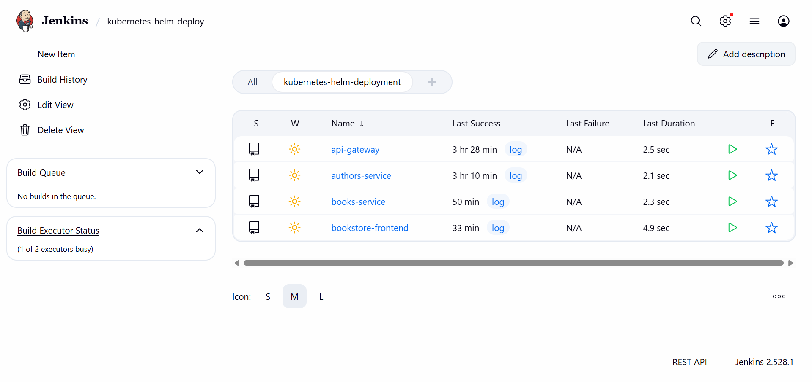
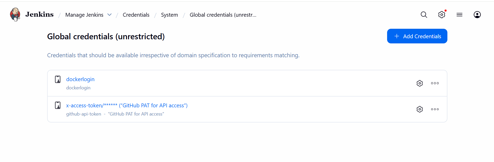
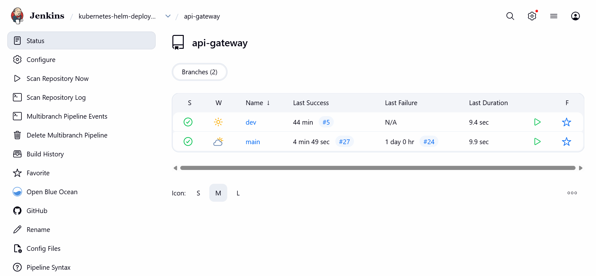
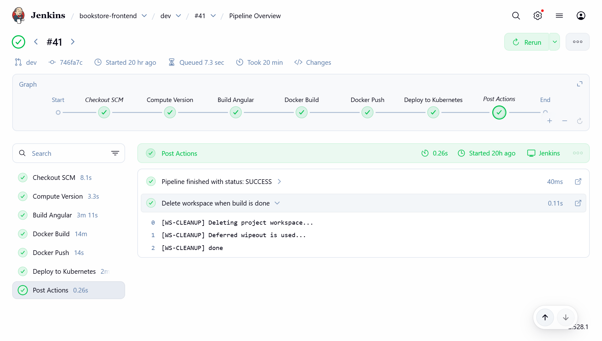
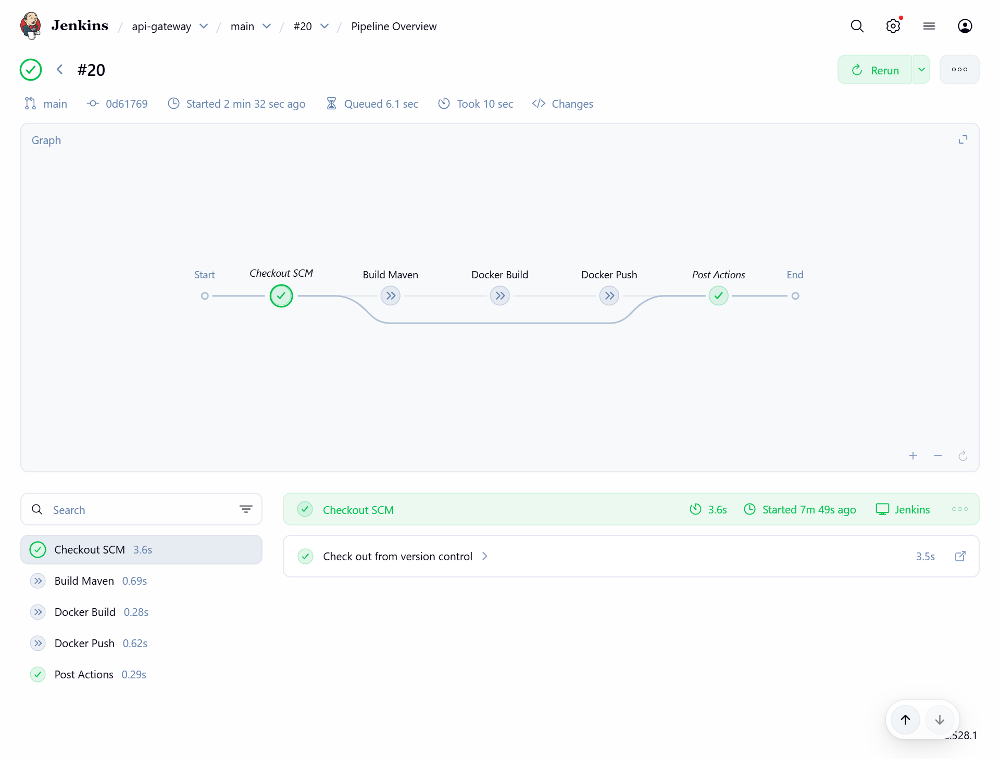

# Kubernetes Deployment Monorepo

This repository contains a monorepo setup for a microservice-based application, designed for streamlined CI/CD using Jenkins, Docker, and Kubernetes deployments.

---

## Project Structure

```
kubernetes-helm-deployment/
├── authors-service/
│   ├── Jenkinsfile
│   ├── Dockerfile
│   ├── pom.xml
├── books-service/
│   ├── Jenkinsfile
│   ├── Dockerfile
│   ├── pom.xml
├── api-gateway/
│   ├── Jenkinsfile
│   ├── Dockerfile
│   ├── pom.xml
├── bookstore-frontend/
│   ├── Jenkinsfile
│   ├── Dockerfile
│   ├── package.json
├── charts/
├── helm-values/
├── scripts/
│   └── version.sh
└── docs/
    ├── cluster-setup.md
    ├── screenshots/
    └── logs/
```

* **Back-end services:** `authors-service`, `books-service`, `api-gateway` (Java/Spring Boot, Maven)
* **Front-end service:** `bookstore-frontend` (Angular, NodeJS)
* **Shared scripts:** `scripts/version.sh` – semantic versioning logic used by all pipelines

Each service has its own `Jenkinsfile`, `Dockerfile`, and **Helm charts**.

---

## CI/CD Architecture

We use **Jenkins Multibranch Pipelines** to manage independent pipelines per service. Each service builds, tests, pushes Docker images, and deploys to Kubernetes.

### Jenkins Dashboard

The dashboard shows all pipeline jobs per service:



---

## Branch Strategy & Environments

The CI/CD setup is **branch-driven** and environment-aware.

| Branch | Purpose     | Docker Tag Format | Target               |
| ------ | ----------- | ----------------- | -------------------- |
| `dev`  | Development | `X.Y.Z-dev`       | Kubernetes Cluster A |
| `main` | Production  | `X.Y.Z`, `latest` | Kubernetes Cluster B |

**Key rules:**

* Pipelines run on **both `dev` and `main`**
* Images are built **only when the service directory changes**
* Versioning is shared via `scripts/version.sh`

---

## Semantic Versioning Strategy

Versioning is handled **outside Jenkinsfiles** via the shared script:

```
scripts/version.sh
```

### Version Format

```
MAJOR.MINOR.PATCH
```

### Increment Rules

| Change Type                 | Version Increment |
| --------------------------- | ----------------- |
| Bug fix / small change      | PATCH             |
| Backward-compatible feature | MINOR             |
| Breaking change             | MAJOR             |

### Branch Behavior

* **dev branch**

  * Automatically increments **PATCH**
  * Appends `-dev` suffix
  * Example: `1.4.3-dev`

* **main branch**

  * Uses the same base version
  * No suffix
  * Also publishes `latest`
  * Example: `1.4.3`, `latest`

### Version Source of Truth

* The versioning script queries **Docker Hub** for the latest image tag of each service
* No build numbers or Git SHA–based tags are used
* Versions increase **only when files inside the service directory change**

#### Docker Hub Images

**API Gateway**
[Docker Hub – API Gateway](docs/screenshots/dockerhub-api-gateway.png)

---

## Jenkins Pipeline Overview

### Version Computation (All Services)

Each pipeline computes the version before building:

```bash
./scripts/version.sh <image-name> <branch>
```

The computed version is then used for:

* Docker build
* Docker push
* Deployment via Helm

---

### Back-end services

1. Checkout code
2. Compute semantic version
3. Maven build: `mvn clean package -DskipTests`
4. Docker build using service directory as context
5. Docker push with computed tag
6. Post-build actions & workspace cleanup

---

### Front-end service (`bookstore-frontend`)

1. Compute semantic version
2. Checkout code
3. Angular build:

```bash
npm ci
npm run build -- --configuration production
```

4. Docker build & push
5. Post-build actions & cleanup

**NodeJS Tool:** NodeJS 24 (configured in Jenkins)

---

## Credentials

| Credential ID      | Type              | Scope  | Username / Token    | Purpose                                                                                   |
| ------------------ | ----------------- | ------ | ------------------- | ----------------------------------------------------------------------------------------- |
| `dockerlogin`      | Username/Password | Global | Docker Hub username | Authenticate with Docker Hub to build and push images using a **Docker Hub access token** |
| `github-api-token` | Username/Password | Global | `x-access-token`    | Authenticate with GitHub using a **fine-grained Personal Access Token (PAT)**             |
| `kubeconfig-dev`   | Secret file       | Global | -                   | Kubernetes Dev cluster access                                                             |
| `kubeconfig-prod`  | Secret file       | Global | -                   | Kubernetes Prod cluster access                                                            |



### GitHub Fine-Grained PAT Details

* Generate a **fine-grained Personal Access Token (PAT)** in GitHub Developer settings
* **Repository access:** Select **“Only select repositories”** and choose this project repository
* Store it in Jenkins as **Username/Password credential**

  * **Username:** `x-access-token`
  * **Password:** GitHub PAT
  * Scope: **Global**

**Required PAT Permissions:**

* `repo:status` – Read and write commit statuses
* `repo:contents` – Read repository contents
* `repo:metadata` – Read repository metadata

### Docker Hub Access Token Details

* Generate an **access token** in Docker Hub
* Store it in Jenkins as **Username/Password credential**

  * **Username:** Docker Hub username
  * **Password:** Docker Hub access token
  * Scope: **Global** – usable by all pipelines

---

## Jenkins Configuration

**Plugins Required:**

* GitHub Branch Source
* Pipeline
* Docker Pipeline
* Maven Integration
* NodeJS Plugin

**Tools Configured:**

* Maven 3.9.11
* JDK 17
* NodeJS 24

---

## Jenkins Multibranch Pipeline Configuration

**Build Configuration:**

Each service is configured as a Jenkins **Multibranch Pipeline** pointing to its own `Jenkinsfile`.

* **Mode:** By Jenkinsfile
* **Script Path:** Example: `api-gateway/Jenkinsfile`
* **Branch Discovery:** All branches (`dev`, `main`)
* **Trigger:** GitHub webhook push events

[Pipeline Configuration](docs/screenshots/pipeline-config.png)

---

### Pipeline Branches per Service

Each service is configured as a **Jenkins Multibranch Pipeline**, automatically discovering and building multiple branches.

**Example – service pipeline showing `dev` and `main` branches:**



---

### Execute Pipeline Only When a Service Changes

All build-related stages are guarded by:

```groovy
when {
  changeset "${SERVICE_DIR}/**"
}
```

This ensures:

* No version bump without real changes
* No unnecessary Docker images
* Clean, predictable version history

---

## GitHub Webhook

**Webhook URL:**

```
https://ngrok-jenkins/github-webhook/
```

* Content type: `application/json`
* Trigger: Push events
* SSL verification: Enabled

[GitHub Webhook Settings](docs/screenshots/webhook-github-settings.png)

---

## Example Workflow

**Change pushed to `authors-service` on `dev`:**

```
authors-service:1.2.4-dev
```

**Promoted to `main`:**

```
authors-service:1.2.4
authors-service:latest
```

### Successful Pipeline Execution

The following screenshot shows a successful pipeline execution for a service, including version computation, build, and Docker push stages:



### Skipped Stages

Other services remain skipped if unchanged. The screenshot below shows stages being **skipped automatically** when no changes are detected in the service directory:



---

## ☸️ Kubernetes Deployment (Helm-Based)

All services are deployed using **Helm charts** in `charts/microservice` instead of raw Kubernetes manifests.

This removes duplication, simplifies configuration management, and standardizes deployments across all microservices.

### Templates

| Template          | Purpose                         |
| ----------------- | ------------------------------- |
| `deployment.yaml` | Pod and container configuration |
| `service.yaml`    | Internal ClusterIP service      |
| `configmap.yaml`  | Environment variables           |
| `ingress.yaml`    | External exposure (optional)    |

### Service Exposure Strategy

| Service            | Access   | Ingress |
| ------------------ | -------- | ------- |
| api-gateway        | External | ✅       |
| bookstore-frontend | External | ✅       |
| authors-service    | Internal | ❌       |
| books-service      | Internal | ❌       |

### Helm Installation (Jenkins VM)

```bash
# Download Helm
curl -fsSL https://get.helm.sh/helm-v3.12.3-linux-amd64.tar.gz -o helm.tar.gz

# Extract
tar -zxvf helm.tar.gz

# Move binary
sudo mv linux-amd64/helm /usr/local/bin/helm
sudo chmod +x /usr/local/bin/helm

# Verify
helm version
```

### Deployment Command

```bash
helm upgrade --install ${SERVICE_DIR} charts/microservice \
  -f helm-values/${SERVICE_DIR}/${valuesFile} \
  --set global.imageTag=${VERSION} \
  --namespace ${namespace} \
  --create-namespace
```

**Dev example:**

```bash
helm upgrade --install api-gateway charts/microservice \
  -f helm-values/api-gateway/values-dev.yaml \
  --set global.imageTag=1.2.3-dev \
  --namespace dev \
  --create-namespace
```

**Prod example:**

```bash
helm upgrade --install api-gateway charts/microservice \
  -f helm-values/api-gateway/values-prod.yaml \
  --set global.imageTag=latest \
  --namespace prod \
  --create-namespace
```

### Jenkins Deployment Flow

1. Select environment based on branch (`dev` or `main`)
2. Choose the correct Helm values file
3. Inject the image tag dynamically
4. Deploy service using Helm
5. Wait for rollout and verify pods

---

## Cluster Setup Documentation

For detailed Kubernetes cluster installation and infrastructure configuration steps, see:

[Cluster Setup Guide](docs/cluster-setup.md)

This document includes the complete setup process for the project infrastructure, including:

* VM network configuration and static IP setup for Jenkins, Dev, and Prod nodes
* Kubernetes installation using **kubeadm**, **kubelet**, and **kubectl**
* Container runtime configuration with **containerd**
* Cluster initialization and control-plane configuration
* Pod networking setup using **Calico CNI**
* SSH access configuration between Jenkins and cluster nodes
* Jenkins integration with Kubernetes using **kubeconfig credentials**
* Installation and configuration of the **NGINX Ingress Controller**
* Hostname resolution for ingress domains via `/etc/hosts`
* TLS configuration using **self-signed certificates** for Dev and Prod environments
* Verification commands to confirm cluster health and connectivity
