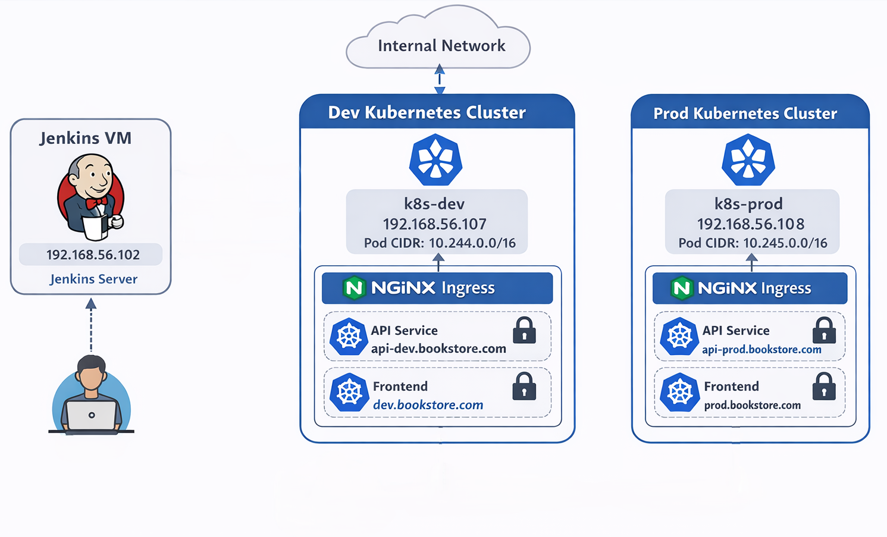

# Kubernetes Cluster Setup Guide

This document contains the complete steps for configuring and setting up the Kubernetes clusters for the monorepo project.

---

## Architecture overview




---

## Network Configuration Summary

| VM               | IP Address     | Interface |
| ---------------- | -------------- | --------- |
| Jenkins VM       | 192.168.56.102 | enp0s8    |
| Dev Cluster VM1  | 192.168.56.107 | enp0s8    |
| Prod Cluster VM2 | 192.168.56.108 | enp0s8    |

---

## STEP 1: Configure Static IPs on All VMs

Follow the instructions for each VM:

### Jenkins VM

```bash
sudo nano /etc/netplan/00-installer-config.yaml
```

*Open netplan config file to set a static IP.*

```yaml
network:
  version: 2
  ethernets:
    enp0s3:
      dhcp4: true         # Primary network interface (DHCP)
    enp0s8:
      dhcp4: no           # Secondary interface (static IP)
      addresses:
        - 192.168.56.102/24
    enp0s9:
      dhcp4: true
```

```bash
sudo chmod 600 /etc/netplan/*.yaml    # Secure the config file
sudo netplan apply                     # Apply network changes
ip addr show enp0s8                    # Verify static IP
```

### Dev Cluster VM1

Same as above but IP is `192.168.56.107`.

```bash
sudo nano /etc/netplan/00-installer-config.yaml
```

```yaml
addresses:
  - 192.168.56.107/24
```

```bash
sudo chmod 600 /etc/netplan/*.yaml
sudo netplan apply
ip addr show enp0s8
```

### Prod Cluster VM2

IP is `192.168.56.108`.

```bash
sudo nano /etc/netplan/00-installer-config.yaml
```

```yaml
addresses:
  - 192.168.56.108/24
```

```bash
sudo chmod 600 /etc/netplan/*.yaml
sudo netplan apply
ip addr show enp0s8
```

---

## STEP 2: Install Kubernetes on VM1 (Dev)

```bash
sudo hostnamectl set-hostname k8s-dev
```

*Set hostname for easier identification in the cluster.*

```bash
sudo swapoff -a
sudo sed -i '/ swap / s/^/#/' /etc/fstab
```

*Disable swap (required by Kubernetes). Persist in `/etc/fstab`.*

```bash
sudo modprobe overlay
sudo modprobe br_netfilter
```

*Load kernel modules required for Kubernetes networking.*

Create module config:

```bash
cat <<EOF | sudo tee /etc/modules-load.d/k8s.conf
overlay
br_netfilter
EOF
```

*Persist kernel modules after reboot.*

Kernel parameters:

```bash
cat <<EOF | sudo tee /etc/sysctl.d/k8s.conf
net.bridge.bridge-nf-call-iptables  = 1
net.bridge.bridge-nf-call-ip6tables = 1
net.ipv4.ip_forward                 = 1
EOF
sudo sysctl --system
```

*Set kernel parameters for networking and IP forwarding.*

Install containerd:

```bash
sudo apt-get update
sudo apt-get install -y containerd
sudo mkdir -p /etc/containerd
containerd config default | sudo tee /etc/containerd/config.toml
sudo sed -i 's/SystemdCgroup = false/SystemdCgroup = true/' /etc/containerd/config.toml
sudo systemctl restart containerd
sudo systemctl enable containerd
```

*Install container runtime containerd and configure to use systemd cgroups.*

Install Kubernetes packages:

```bash
sudo mkdir -p /etc/apt/keyrings
curl -fsSL https://pkgs.k8s.io/core:/stable:/v1.35/deb/Release.key | sudo gpg --dearmor -o /etc/apt/keyrings/kubernetes.gpg
echo "deb [signed-by=/etc/apt/keyrings/kubernetes.gpg] https://pkgs.k8s.io/core:/stable:/v1.35/deb/ /" | sudo tee /etc/apt/sources.list.d/kubernetes.list
sudo apt-get update
sudo apt-get install -y kubelet kubeadm kubectl
sudo apt-mark hold kubelet kubeadm kubectl
```

*Add Kubernetes repository, install kubelet, kubeadm, kubectl, and prevent automatic upgrades.*

Initialize cluster:

```bash
sudo kubeadm init --apiserver-advertise-address=192.168.56.107 --pod-network-cidr=10.244.0.0/16 --control-plane-endpoint=192.168.56.107
```

*Initialize Kubernetes control plane with pod CIDR and API server advertise address.*

Configure kubectl:

```bash
mkdir -p $HOME/.kube
sudo cp -i /etc/kubernetes/admin.conf $HOME/.kube/config
sudo chown $(id -u):$(id -g) $HOME/.kube/config
kubectl get nodes
```

*Set up kubectl for the current user to manage the cluster.*

Install Calico CNI:

```bash
kubectl apply -f https://raw.githubusercontent.com/projectcalico/calico/v3.28.0/manifests/calico.yaml
kubectl taint nodes k8s-dev node-role.kubernetes.io/control-plane:NoSchedule-
kubectl get nodes
kubectl get pods -A
```

*Install Calico networking plugin and remove taint for single-node scheduling.*

---

## STEP 3: Install Kubernetes on VM2 (Prod)

*Repeat the Dev cluster steps but with hostname `k8s-prod`, IP `192.168.56.108`, and Pod CIDR `10.245.0.0/16`.*

---

## STEP 4: SSH Access from Jenkins

```bash
ssh-keygen -t rsa -b 4096 -N "" -f ~/.ssh/id_rsa
```

*Generate SSH key for Jenkins user.*

```bash
ssh-copy-id ubuntu@192.168.56.107
ssh-copy-id ubuntu@192.168.56.108
```

*Copy public key to both cluster VMs.*

```bash
ssh ubuntu@192.168.56.107 "hostname"
ssh ubuntu@192.168.56.108 "hostname"
```

*Test SSH connections.*

---

## STEP 5: Copy Kubeconfigs to Jenkins VM

```bash
sudo su - jenkins
mkdir -p ~/.kube
scp ubuntu@192.168.56.107:~/.kube/config ~/.kube/config-dev
scp ubuntu@192.168.56.108:~/.kube/config ~/.kube/config-prod
chmod 600 ~/.kube/config-dev ~/.kube/config-prod
sed -i 's|server:.*|server: https://192.168.56.107:6443|g' ~/.kube/config-dev
sed -i 's|server:.*|server: https://192.168.56.108:6443|g' ~/.kube/config-prod
```

*Copy kubeconfig files for Jenkins to access clusters and set proper permissions. Update server IPs.*

---

## STEP 6: Install kubectl on Jenkins VM

```bash
sudo apt-get update
sudo apt-get install -y kubectl
kubectl version --client
```

*Install Kubernetes CLI to allow Jenkins to run kubectl commands.*

---

## STEP 7: Test Kubernetes Access

```bash
kubectl --kubeconfig=~/.kube/config-dev get nodes
kubectl --kubeconfig=~/.kube/config-prod get nodes
```

*Verify that Jenkins can access both Dev and Prod clusters.*

---

## STEP 8: Jenkins Plugins & Credentials

* Install **Kubernetes CLI Plugin** (required for kubectl commands)
* Install **Pipeline** plugin
* Add **kubeconfig-dev** and **kubeconfig-prod** as secret file credentials in Jenkins

---

## STEP 9: Sample Jenkins Pipeline

*Pipeline example to build Docker images, push to registry, and deploy to Dev/Prod clusters using kubeconfig credentials.*

---

## STEP 10: Verification Commands

Check nodes, pods, containerd, network, and API server connectivity on all VMs.

---

## STEP 11: Install NGINX Ingress Controller and Configure Node IPs

### 11.1 Install NGINX Ingress Controller (Both Clusters)

Install using the baremetal manifest:
```bash
kubectl apply -f https://raw.githubusercontent.com/kubernetes/ingress-nginx/main/deploy/static/provider/baremetal/deploy.yaml
kubectl get pods -n ingress-nginx
kubectl get svc -n ingress-nginx
```

### 11.2 Enable hostNetwork to Bind Port 80 Directly on the VM

By default the baremetal install uses NodePort. Patch the controller to use `hostNetwork` so it binds directly to port 80 and 443 on the node IP — no port number needed in URLs.
```bash
kubectl patch deployment ingress-nginx-controller -n ingress-nginx \
  --type='json' \
  -p='[
    {"op":"add","path":"/spec/template/spec/hostNetwork","value":true},
    {"op":"add","path":"/spec/template/spec/dnsPolicy","value":"ClusterFirstWithHostNet"}
  ]'

kubectl rollout status deployment/ingress-nginx-controller -n ingress-nginx
```

### 11.3 Verify Port 80 is Listening on the Node
```bash
# Pod IP should match the node IP (192.168.56.107 for Dev, 192.168.56.108 for Prod)
kubectl get pod -n ingress-nginx -o wide

# Port 80 should be listed
ss -tlnp | grep :80
```

### 11.4 Configure Node IP for kubelet (Both Clusters)
```bash
sudo nano /etc/default/kubelet
# Add for Dev
KUBELET_EXTRA_ARGS="--node-ip=192.168.56.107"
# Add for Prod
KUBELET_EXTRA_ARGS="--node-ip=192.168.56.108"
```

### 11.5 Restart kubelet
```bash
sudo systemctl daemon-reload
sudo systemctl restart kubelet
```

### 11.6 Verify Node IP Configuration
```bash
kubectl get nodes -o wide
kubectl describe node k8s-dev | grep -A 5 "Addresses:"
kubectl describe node k8s-prod | grep -A 5 "Addresses:"
```

### 11.7 Test Ingress Controller
```bash
kubectl get ingress -n dev
kubectl get ingress -n prod

curl http://api-dev.bookstore.com/api/authors
curl http://api-prod.bookstore.com/api/authors
```

---

## STEP 12: Update /etc/hosts for Cluster Hostnames

To enable local resolution of the cluster ingress hosts, edit `/etc/hosts` on relevant VMs (Dev, and Prod).

api-dev.bookstore.com and api-prod.bookstore.com are used for api gateway service 
dev.bookstore.com and prod.bookstore.com are used for bookstore frontend service 

### Dev Cluster VM

```bash
sudo nano /etc/hosts
```

Add:

```
192.168.56.107   api-dev.bookstore.com
192.168.56.107   dev.bookstore.com
```

Save and exit. Test:

```bash
ping -c 3 api-dev.bookstore.com
ping -c 3 dev.bookstore.com
```

### Prod Cluster VM

```bash
sudo nano /etc/hosts
```

Add:

```
192.168.56.108   api-prod.bookstore.com
192.168.56.108   prod.bookstore.com
```

Save and exit. Test:

```bash
ping -c 3 api-prod.bookstore.com
ping -c 3 prod.bookstore.com
```

---

## STEP 13: Enable SSL with Self-Signed Certificates

### 13.1 Generate Self-Signed Certificate (Dev Cluster VM)

Generate a single certificate covering both dev domains:
```bash
openssl req -x509 -nodes -days 365 -newkey rsa:2048 \
  -keyout bookstore-dev.key \
  -out bookstore-dev.crt \
  -subj "/CN=bookstore-dev/O=bookstore" \
  -addext "subjectAltName=DNS:dev.bookstore.com,DNS:api-dev.bookstore.com"
```

---

### 13.2 Create Kubernetes TLS Secret
```bash
kubectl create secret tls bookstore-dev-tls \
  --cert=bookstore-dev.crt \
  --key=bookstore-dev.key \
  -n dev

# Verify secret was created
kubectl get secret bookstore-dev-tls -n dev
```

---

### 13.3 Update Ingress Resources

Update both Ingress files to add TLS configuration referencing the secret created.

---

### 13.4 Verify Port 443 is Listening

Since hostNetwork is enabled the ingress controller binds directly to the node:
```bash
ss -tlnp | grep :443
```
[TLS Ingress](screenshots/tls-ingress.png)

---

### 13.5 Repeat for Prod Cluster VM

Run the same steps on the Prod VM (`192.168.56.108`) with prod domain names:
```bash
openssl req -x509 -nodes -days 365 -newkey rsa:2048 \
  -keyout bookstore-prod.key \
  -out bookstore-prod.crt \
  -subj "/CN=bookstore-prod/O=bookstore" \
  -addext "subjectAltName=DNS:prod.bookstore.com,DNS:api-prod.bookstore.com"

kubectl create secret tls bookstore-prod-tls \
  --cert=bookstore-prod.crt \
  --key=bookstore-prod.key \
  -n prod
```

---

## Summary

* Two clusters are ready for CI/CD:

  * Dev: 192.168.56.107, Pod CIDR 10.244.0.0/16
  * Prod: 192.168.56.108, Pod CIDR 10.245.0.0/16
  * Jenkins: 192.168.56.102
* NGINX Ingress configured for both clusters.

